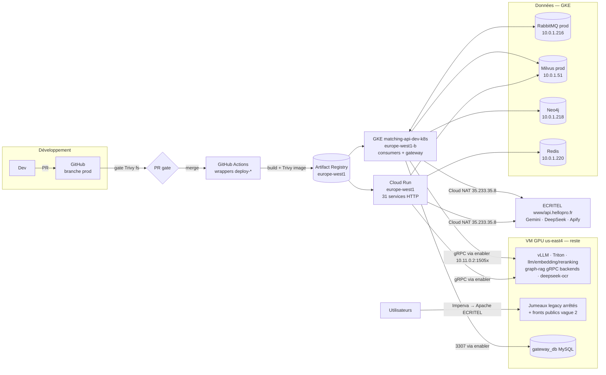
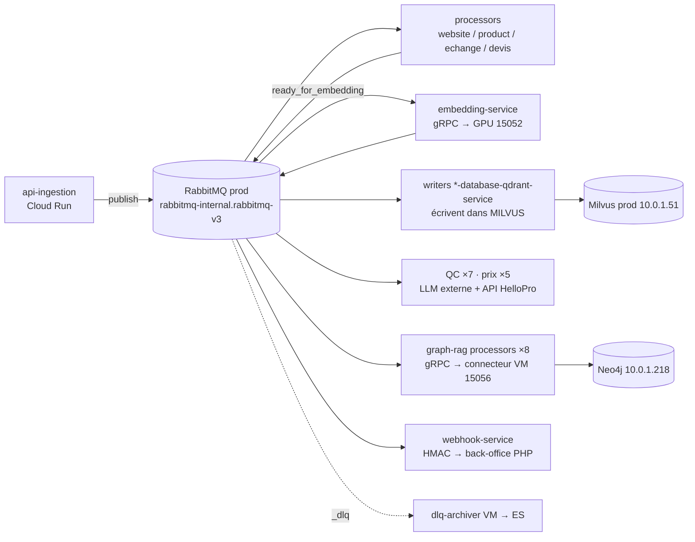
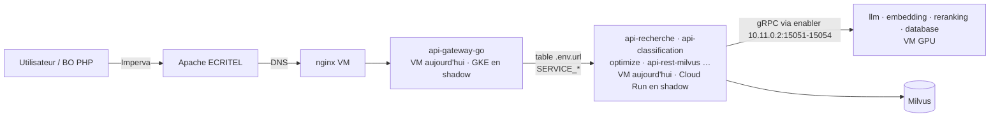
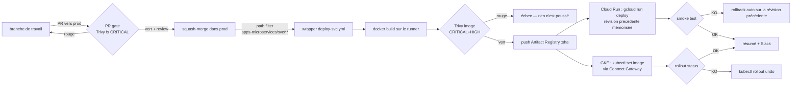

# Architecture après migration — comment ça marche maintenant

> **Pour toute l'équipe : devs, lead, ops.** Ce document décrit la plateforme telle qu'elle fonctionne **depuis la
> migration** — où tourne quoi, comment les flux circulent, comment un changement de code arrive en production, où
> regarder quand ça ne va pas, et quoi faire quand ça bloque.
>
> État au **2026-09-21** : lot L1 basculé, L2 → L7 en cours (plan par lots), vague 2 à venir. La section 3 dit
> précisément ce qui est déjà de l'autre côté. Ce document sera mis à jour à chaque lot.
>
> Les éléments marqués **[à confirmer]** n'ont pas été vérifiés sur le terrain au moment de la rédaction.

---

## 1. Vue d'ensemble

Trois plateformes d'exécution, une seule source de vérité pour le code (`prod` sur GitHub), un seul registre d'images,
un seul broker de production. **Le GPU et ce qui en dépend restent sur la VM, définitivement.** Tout le reste part
vers Cloud Run (services HTTP) ou GKE (consommateurs de files, cluster gateway).

---

## 2. Les trois plateformes

| Plateforme | Région | Ce qu'elle héberge | Comment on y accède |
|---|---|---|---|
| **VM GPU** `vm-embedding-g2-std-24-use` | us-east4-c, IP interne `10.11.0.2` | **Pérenne** : la pile d'inférence (`vllm-server`, `triton-server`, `llm-service`, `embedding-model-service`, `reranking-model-service`, `database-recherche-service`, `deepseek-ocr`), les 4 backends gRPC graph-rag, `gateway_db` MySQL. **Transitoire** : les jumeaux legacy arrêtés des services basculés (filet de rollback 7 jours), les services des lots non encore passés, les fronts publics jusqu'à la vague 2, ELK / Prometheus / Grafana locaux | SSH, user `devhp`, `~/RAG-HP-PUB`, `docker` |
| **GKE** `matching-api-dev-k8s` | europe-west1-b, 4 nœuds `c2-standard-8`, autoscaler 4→6 | Namespace `apps-microservices` : les **34 consumers**, le cluster gateway B1 (`api-gateway-go`, `mcp-gateway-service`, `mcp-zoho-service`, `mcp-google-templates-runner`), les always-on B3. Namespaces data : `rabbitmq-v3` (broker **prod**), `default` (broker **dev** `rabbitmq-i2`, Redis), Milvus prod/dev, `neo4j-graphrag` | `kubectl` via Connect Gateway, identité utilisateur (config gcloud `kubectl-local`) — depuis la VM Manager ou un poste configuré |
| **Cloud Run** | europe-west1 | **31 services HTTP** : RAG core (`api-recherche`, `api-classification`, `api-chat-llm`…), graph-rag API ×3, MCP ×8, fronts Next.js, `image-comparison`, `crawler-monitor-backend`… URL `https://<service>-xqksdwdiga-ew.a.run.app`, `min-instances=0`, SA `cloudrun-services` | `gcloud run`, console GCP |

**Le broker de production est le point de rendez-vous.** VM et GKE parlent au même RabbitMQ `10.0.1.216` : c'est ce qui
permet de basculer les consumers un par un. La règle absolue : **jamais deux jumeaux d'un même service actifs sur la même
file** — sinon ils se partagent les messages sans qu'aucune erreur n'apparaisse.

---

## 3. Où en est la migration aujourd'hui

| Périmètre | État au 21/09 | Où ça tourne |
|---|---|---|
| **L1** — `deepseek-metrics-collector-service`, `nettoyage-bruit-ocr-service` | ✅ **basculé le 19/09** | GKE, données prod. Jumeaux VM `Exited` conservés jusqu'au 26/09 |
| **L2 → L6** — 32 consumers (QC, prix, processors, writers, graph-rag, embedding, template-llm, webhook) | ⬜ planifiés 22 → 29/09 | VM (prod) · GKE en shadow sur le broker **dev** |
| **L7** — B1 cluster gateway + B3 always-on | ⬜ planifié 30/09 | VM (prod) · GKE shadow |
| **Vague 2** — API HTTP Cloud Run, MCP, fronts, entrées publiques (P4 → P9) | ⬜ plan à écrire après L7 | VM sert le trafic · Cloud Run en shadow sans trafic |
| **Restent sur la VM** — GPU, backends gRPC, bases locales, outillage (P10) | définitif | VM |

Le [tableau de suivi](suivi-bascule-par-lots.md) est la source de vérité **chaîne par chaîne**, mis à jour à chaque geste.

**Deux règles pendant la coexistence** :

- **Pas de `git pull` sur la VM** tant que des jumeaux arrêtés servent de filet de rollback : trois services
  (`nettoyage-bruit-ocr-service`, `embedding-service`, `document-echange-processor-service`) exécutent le **checkout git de
  la VM** via un bind-mount de leur dossier `app/`, pas leur image. Un `pull` changerait le code qu'un rollback relancerait.
- **Gel ciblé de `prod`** : aucun merge touchant `apps-microservices/<service>` ou `libs/` pour un service d'un lot **non
  encore passé**. `docs/` et les services déjà basculés (après re-scan) restent libres.

---

## 4. Les flux

### 4.1 Le plan asynchrone — ingestion et traitement

Un consumer **s'abonne** à une file, il n'a pas d'adresse. Personne ne l'appelle. C'est pourquoi sa bascule ne change
aucune URL : on arrête le jumeau VM, on repointe le secret du broker, le pod GKE s'abonne à la même file.

**Files mortes (`_dlq`)** : alimentées par les `nack`, vidées par le `dlq-archiver` de la VM vers Elasticsearch pour les
files de sa liste `DLQ_QUEUES` ; les autres n'ont **aucun consommateur** — c'est normal, mais elles s'accumulent sans
surveillance (F-HP-OBS-003).

**Fenêtre tarifaire DeepSeek** : `nettoyage-bruit-ocr-service`, `QC-caracterisation`, `template-llm-service` et
`QC-fabricant-reference` **se désabonnent volontairement** de leur file **01h-04h et 06h-10h UTC** (04h-07h et 09h-13h
Paris+1 / heure locale). `consumers=0` à ces heures est nominal ; les messages attendent en file.

### 4.2 Le plan HTTP — recherche et API

**Rien de ce plan n'a encore basculé** : les entrées publiques (`conseils.hellopro.fr`, `rag./api./mcp.hellopro.eu`)
pointent toujours sur la VM. Les services Cloud Run tournent en shadow, sans trafic. La bascule du trafic HTTP est la
**vague 2** — elle passe par le LB HTTPS + Cloud Armor déjà provisionnés, et pour `conseils` par une décision produit/SEO.

Pour les appels **service → service**, la table de correspondance des adresses est dans
[`correspondance-endpoints-vm-cloud.md`](correspondance-endpoints-vm-cloud.md). Les appels qui passent par la gateway
(`/<nom>-service`) ne changent pas ; les appels directs `http://<conteneur>:<port>` sont ce que le
[pré-contrôle](guide-pre-check-service.md) cherche.

### 4.3 Le GPU — l'enabler gRPC

Les services migrés ne perdent pas le GPU : un proxy TCP (`grpc-gpu-proxy`, haproxy) sur la VM expose les backends
gRPC sur `10.11.0.2:15051-15058` (llm, embedding, reranking, database, puis graph-rag milvus / database-connector /
normalize / spacy). Cloud Run et GKE l'atteignent par le VPC (`allow-intra-lan`), **sans firewall supplémentaire**.

⚠️ Les ports **backend** ne sont pas `50051` : quatre clients gRPC de `libs/common-utils` portent ce défaut erroné, masqué
tant que l'environnement fournit `*_SERVICE_URL` (F-HP-DEV-005). Le proxy est un conteneur **manuel** sur la VM, pas encore
codifié (F-HP-IaC-001).

### 4.4 Les sorties vers l'extérieur

| Destination | Depuis GKE / Cloud Run | Particularité |
|---|---|---|
| **ECRITEL** (`www.hellopro.fr`, `api.hellopro.fr`) | Cloud NAT, IP statique **`35.233.35.8`** | Whitelistée chez ECRITEL. Cloud Run doit être en `vpc-egress=all-traffic` pour sortir par la NAT (6 services le sont) ; en `private-ranges-only` l'IP de sortie est Google, dynamique, **non whitelistable** |
| LLM (Gemini, DeepSeek), Apify, Ringover, Leexi, Semrush | Cloud NAT | Clés en Secret Manager |
| Back-office PHP (`webhook_update_produit_scrapping.php`) | Cloud NAT | Signature HMAC `KEY_WEBHOOK` |
| VM GPU (`10.11.0.2`) | VPC interne | gRPC 1505x, MySQL 3307, Elasticsearch **[à confirmer : 9200 via VPC]** |

---

## 5. Réseau, identités, sécurité

| Sujet | Comment c'est fait |
|---|---|
| **Réseau** | Un VPC (`hellopro-dev-vpc`), un connecteur VPC pour Cloud Run, un Cloud NAT `hellopro-nat-config` en `MANUAL_ONLY` avec l'IP statique (**hors Terraform**, F-HP-IaC-002). DNS privé `hellopro-private`. Les services GKE s'adressent aux bases par **DNS in-cluster** (`rabbitmq-internal.rabbitmq-v3.svc.cluster.local`), la VM par IP (`10.0.1.216`) — même broker |
| **Identités GCP** | `cloudrun-services` (runtime Cloud Run) · `github-deployer` (CD, via **Workload Identity Federation** — aucune clé JSON) · `devops-infra-sa` (Terraform, impersonation) · `vm-gpu-runtime` (VM) |
| **Identité `kubectl`** | Toujours l'**utilisateur** via Connect Gateway (config gcloud `kubectl-local`), jamais l'impersonation `devops-infra-sa`. Config `default` pour `gcloud secrets`, `gcloud run`, Cloud Build |
| **Exposition** | Cloud Run : `ingress internal` pour les services non publics, `all` + auth applicative pour les autres. GKE : aucune IP publique sur `apps-microservices` ; les bases ont encore des LB à IP publique (F-HP-SEC-001, durcissement post-migration). LB HTTPS + Cloud Armor provisionnés en mode **preview**, activés à la vague 2 |
| **Images** | Tag = SHA git court (`abc1234`), jamais `latest`. Chaque image passe le **gate Trivy image** avant le push. VEX signé le 17/09 pour les 50 CRITICAL non corrigeables (`linux-libc-dev`, perl bookworm…) |
| **Ce qui reste à durcir** | Workload Identity par pod, NetworkPolicies default-deny, suppression de l'IP publique de la VM, codification Terraform de la NAT et du proxy — **post-migration J+14** |

---

## 6. Configuration et secrets

**Avant** : un `.env` unique sur la VM, injecté dans **tous** les conteneurs via `env_file` (~120 variables dont ~40
secrets, chaque service voit tout). **Après** : chaque service reçoit **uniquement** les variables qu'il déclare.

| Où | Comment | Règle |
|---|---|---|
| **Secret Manager** | Secrets `platform-*` partagés (`platform-rabbitmq-url` prod, `platform-rabbitmq-url-dev`, `platform-zilliz-*`, `platform-redis-url`, `platform-llm-hp-secrets`…), gérés en Terraform, seedés depuis le `.env` VM | Source de vérité des valeurs. **Jamais tapée, jamais affichée** : lue par `gcloud secrets versions access` au moment de l'usage |
| **Cloud Run** | `--set-secrets VAR=secret:latest` dans le wrapper CD ; variables non secrètes en `--set-env-vars` | Ne jamais passer `PORT`, `K_SERVICE`, `K_REVISION`, `K_CONFIGURATION` (réservées, échec du deploy) |
| **GKE** | Secrets Kubernetes par service, **deux conventions** : `<service>-rabbitmq` (28, clé `rabbitmq-url`) et `<service>-secrets` (7 writers, multi-clés `rabbitmq-url` + `zilliz-user` + `zilliz-password` + `redis-url`). Manifestes dans le dépôt infra (`RAG-HP-PUB-infra/infra-microservices/infra-gke-cluster/manifest/apps/<service>/`) | Modifier un secret = **`kubectl patch` clé par clé**. `create --dry-run \| apply` reconstruit l'objet et **efface les autres clés** |
| **Ce que le code lit** | Python : `pydantic BaseSettings` (`app/core/credentials.py` ou `config.py`) avec des défauts | Une variable lue par le code et absente du manifeste prend le **défaut du code**. Le pré-flight compare les deux listes **par noms**, jamais en affichant les valeurs |

La matrice complète, variable par variable : [`env-migration-matrix.md`](env-migration-matrix.md).

---

## 7. Comment un changement de code arrive en production

| Étape | Détail |
|---|---|
| **Branches** | `features/poc` = référence applicative des devs (gelée depuis le 21/09) · **`prod`** = **le déclencheur CD**, alimentée **uniquement par PR** (protection : PR + approbation + check requis, pas de bypass, pas de force-push) · `features/infra-gcp-prod` = dépôt infra, **commit seulement, pas de push** (règle d'équipe) |
| **PR gate** (`pr-gate-prod.yml`) | Sur **toute** PR vers `prod` : Trivy **système de fichiers** du dépôt entier, `vuln,misconfig,secret`, CRITICAL, `--ignore-unfixed`. Une CRITICAL corrigeable **n'importe où** dans le dépôt bloque **toutes** les PR, docs comprises — c'est arrivé le 19/09 (`anyio`) |
| **Wrappers CD** (`deploy-<service>.yml`) | Un par service, `on: push: branches: [prod]` avec **filtre de chemin** `apps-microservices/<service>/**` (+ `libs/` quand dépendance). Un commit `docs/` ne déclenche **rien**. 26 wrappers Cloud Run, **2 GKE** (`product-processor-service`, `mcp-gateway-service`) |
| **Réutilisable Cloud Run** (`deploy-cloud-run.yml`) | Auth WIF → build → **Trivy image** (gate CRITICAL+HIGH, désactivable par input pour les bases lourdes) → push AR → révision précédente mémorisée → `gcloud run deploy` (secrets, env, connecteur, egress, ingress) → smoke test (curl ×3, **sauté si ingress internal**) → **rollback auto** si KO → résumé Slack |
| **Réutilisable GKE** (`deploy-gke-service.yml`) | Build + push → creds Connect Gateway → `kubectl set image` (**chirurgical** : env, sondes, secrets intacts) → `rollout status` → `rollout undo` si KO → vérification de l'image live |
| **Les 32 autres GKE** | **Pas de rail CD** (F-HP-MIG-003) : déploiement par `kubectl apply` des manifestes du dépôt infra, images bâties par Cloud Build (`gke-rebuild-j0.sh`, tag `shadow-2026-09-15`). Le rail sera généralisé après la migration |

**Ce que ça implique pour un dev** : ton code n'atteint la production **que** par une PR vers `prod`, gate verte,
merge. Le déploiement suit tout seul pour Cloud Run ; pour un consumer GKE, le DevSecOps le déploie à la main tant que
le rail n'est pas généralisé — demande-le.

---

## 8. Observabilité — où regarder

| Quoi | Cloud Run | GKE | VM (ce qui y reste) |
|---|---|---|---|
| **Logs** | `gcloud run services logs read <svc> --region europe-west1` · Cloud Logging `resource.type="cloud_run_revision"` | `kubectl -n apps-microservices logs deploy/<svc> --all-pods --prefix -f` · Cloud Logging `resource.type="k8s_container"` (**collecté depuis le 21/09 14h21** — F-HP-OBS-004 ; lignes Python en sévérité `ERROR` car stderr ; `print()` exclu par choix FinOps — guide [`acces-logs-services-migres.md`](acces-logs-services-migres.md)) | `docker logs <conteneur>` · ELK local |
| **État** | `gcloud run revisions list --service <svc>` | `kubectl get pods -l app=<svc>` · `describe pod` (événements, `RESTARTS`) | `docker ps` |
| **Shell** | — (pas d'exec sur Cloud Run) | `kubectl exec -it deploy/<svc> -- /bin/sh` | `docker exec -it` |
| **Métriques** | Cloud Monitoring (latence, 5xx, instances) | Prometheus GKE pour les services qui exposent `/metrics` ; les consumers « option B » **n'exposent rien** — leur santé se lit sur la file | Prometheus / Grafana VM |
| **Files RabbitMQ** | — | `kubectl -n rabbitmq-v3 exec <pod> -- rabbitmqctl list_queues name messages consumers` ; UI par `kubectl port-forward svc/rabbitmq-ui 15672` (**NodePort, pas d'IP**) | idem, le broker est sur GKE |
| **Tracking par fichier** (QC, prix) | — | ⚠️ **perdu pour les services basculés** (F-HP-MIG-008, décision du 21/09) — remplacé par les logs pod | UI `qc-tracking-service` pour les services encore sur la VM |

⚠️ La ligne de connexion au broker **contient le mot de passe en clair** dans les logs de tous les consumers
(F-HP-SEC-021). Masquer avant de partager : `| sed -E 's#(amqp://[^:]+):[^@]*@#\1:***@#g'`.

Chaque service basculé a son **rapport** dans [`rapports/`](rapports/) : ce qui a changé, les preuves, et les
commandes d'accès exactes.

---

## 9. Les procédures

| Procédure | Document | Qui |
|---|---|---|
| Basculer un lot (P0 → P7) et le rollbacker (R) | [`procedure-bascule-un-lot.md`](procedure-bascule-un-lot.md) | DevSecOps, référent dev présent |
| Composition, prérequis, vigilances d'un lot | [`lots/L1.md`](lots/L1.md) … `L7.md` | DevSecOps · LEAD |
| Pré-contrôler son service avant son lot | [`guide-pre-check-service.md`](guide-pre-check-service.md) | Dev, avec Claude |
| Savoir qui est où pendant la coexistence | [`suivi-bascule-par-lots.md`](suivi-bascule-par-lots.md) | Tous (lecture) · DevSecOps (écriture) |
| Rapport de bascule d'un service | [`rapports/_TEMPLATE.md`](rapports/_TEMPLATE.md) | DevSecOps, à la clôture de chaque bascule |
| Calendrier, règles, gel, communication | [`plan-bascule-par-lots.md`](plan-bascule-par-lots.md) | Tous |

**Le rollback d'un service, dans l'ordre** — et l'ordre n'est pas négociable :
`kubectl scale --replicas=0` (libérer la file) → `docker start` des jumeaux VM (la VM se réabonne, 7 s) → vérifier
`consumers ≥ 1` → repointer le secret sur le broker dev → `scale --replicas=1`. **Mesuré : ~2 minutes.** Exécuté par le
DevSecOps ; les devs **signalent**, ils ne rollbackent pas.

---

## 10. Que faire quand ça bloque

### 10.1 La PR gate est rouge

| Symptôme | Cause probable | Action |
|---|---|---|
| Table Trivy avec `Status: fixed` | Une CVE **corrigeable** est sortie depuis le dernier scan, parfois dans un service que la PR ne touche pas | **On corrige, on n'ignore pas** : PR séparée bumpant la dépendance dans **tous** les fichiers concernés (`grep -rlE '^lib==x.y.z$' --include=requirements.txt`), merge, puis la PR d'origine |
| `Status: affected` / `will_not_fix`, pas de version corrigée | CVE non corrigeable côté distribution | Statement **VEX** (justification `not_affected` : code non exécuté, non atteignable…), signé RSSI, puis `.trivyignore` ciblé |
| Le gate reste rouge après « Re-run jobs » | **Re-run rejoue le même commit** — il ne voit pas le `prod` corrigé | Pousser un **nouveau commit** sur la branche : `git merge prod` puis `git push` (jamais de rebase/force sur une branche partagée) |
| `secret` détecté | Une valeur qui ressemble à une clé dans le diff | Ne **jamais** la coller dans la PR ou un ticket. Retirer, régénérer si c'était vrai, signaler au DevSecOps |

### 10.2 Le CD échoue au build

| Symptôme | Cause | Action |
|---|---|---|
| Trivy **image** rouge sur une CRITICAL/HIGH corrigeable | Base image ou dépendance vieillie | Bump de la base (`python:3.10-slim`, `node:22-slim`…) ou du pin ; `RUN apt-get upgrade` du stage final pour les CVE OS |
| `RUN --mount=type=cache` refusé | Builder sans BuildKit | Cloud Build : `env: ['DOCKER_BUILDKIT=1']` ; runner GitHub : natif |
| `npm error EBADENGINE` | `npm@latest` (12) exige Node ≥ 22 | Passer la base en `node:22-slim` — Node 20 est en fin de vie |
| `ERR_PNPM_IGNORED_BUILDS` (sharp…) | pnpm ≥ 10 bloque les scripts de build | Pin `pnpm@9` |
| `COPY` d'un chemin absent | Dépendance cross-service (`libs/`, autre service) hors du contexte | Contexte = **racine** du dépôt ; ajouter le chemin au contexte / à `EXTRA_PATHS` |
| `ImportError` au démarrage après rebuild | Dépendance non pinnée qui a bougé (`mcp-proxy`, `mcp`…) | Pin explicite dans `requirements.txt` — règle « pin-on-port » (F-HP-BUILD-001) |

Un build rouge **ne déploie rien** : la révision / le pod en place continue de servir.

### 10.3 Le CD échoue au déploiement

| Plateforme | Ce qui se passe tout seul | Ce que tu vérifies |
|---|---|---|
| **Cloud Run** | Smoke test KO → **rollback automatique** sur la révision précédente | `gcloud run revisions list --service <svc> --region europe-west1` : la révision servie ; `gcloud run services logs read <svc> --limit 100`. Causes classiques : variable réservée passée en env, `gunicorn -w N` trop gourmand pour 1 vCPU (503 en boucle → `-w 2` + cpu-boost), health check sur `/` alors que l'app répond sur `/status` |
| **GKE** | `rollout status` KO → **`rollout undo`** automatique | `kubectl describe pod -l app=<svc>` (événements), `kubectl logs --previous`. Causes classiques : `CreateContainerConfigError` (secret ou clé absente), `ImagePullBackOff` (nom d'image en **minuscules** dans Artifact Registry — les dossiers `QC-*` donnent des images `qc-*`), `CrashLoopBackOff` (variable manquante → défaut du code → plantage) |

### 10.4 Un consumer ne consomme pas

| Observation | Avant de conclure à une panne |
|---|---|
| `consumers=0` sur sa file | **L'heure** : 01h-04h / 06h-10h UTC = fenêtre tarifaire pour 4 services, nominal. Sinon : le pod est-il `Running` ? son secret pointe-t-il sur le **bon broker** (`rabbitmq-internal.rabbitmq-v3` = prod, `rabbitmq-i2-internal.default` = dev) ? |
| `consumers=0` sur une `_dlq` | **Normal** — pas de consommateur permanent |
| `consumers` supérieur au nombre de réplicas GKE | **Deux jumeaux actifs** (VM + GKE) : le jumeau VM n'a pas été arrêté, ou a été redémarré. `docker ps` sur la VM, `docker stop` immédiat |
| `messages` qui monte hors fenêtre | Le service ne suit plus : `kubectl scale --replicas=+1`, regarder les logs pour une erreur récurrente (LLM en quota, cible injoignable) |
| Le pod est `Running` mais rien dans les logs depuis longtemps | Un consumer au repos ne logue rien — vérifier la file, pas les logs |

### 10.5 Une écriture est dupliquée ou incorrecte

C'est le **motif de rollback** du lot : deux jumeaux ont consommé la même file, ou un writer a écrit sur la mauvaise
instance. Signaler au DevSecOps **avant** de corriger les données ; le rollback prend 2 minutes, l'analyse ensuite.

### 10.6 Qui contacter

| Sujet | Qui |
|---|---|
| Infra, secrets, déploiement, rollback, accès | **DevSecOps** |
| Comportement applicatif, idempotence, décision produit sur un flux | **LEAD** |
| Vulnérabilité, VEX, exposition de secret | **RSSI** (via DevSecOps) |
| Entrées publiques, DNS `hellopro.fr`, Apache, Imperva | ECRITEL — **via** le DevSecOps, sous contrat |

---

## 11. Pièges à connaître — ils ont tous coûté du temps

- **`embedding-service` ≠ `api-embedding-service`** : consumer GKE vs service HTTP Cloud Run.
- **`*-database-qdrant-service` écrivent dans Milvus.** `ZILLIZ_*` désigne Milvus, pas le SaaS Zilliz.
- **Deux noms perdent leur `-service` sur GKE** : `prix-milvus-processor`, `graph-rag-dlq-manager`.
- **Deux conteneurs VM n'ont pas le préfixe `rag-hp-pub-`** : `webhook-service`, `mcp-google-templates-runner`.
- **`rabbitmqctl` sépare par des tabulations** : `grep 'nom '` (espace) ne matche rien. `grep -E '^nom\s'`.
- **`kubectl logs deploy/…` pendant un rollout lit parfois l'ancien pod** : cibler le pod `Running` par son nom.
- **Les consumers ignorent SIGTERM** (`Exited 137` systématique) — F-HP-DEV-006 ; sans effet sur une file vide.
- **Le `.env` de la VM est partagé** : une variable vue dans un conteneur n'est pas forcément lue par lui.
- **Le management RabbitMQ n'est pas exposé en IP** : `curl 10.0.1.216:15672` attend indéfiniment ; `port-forward` ou `rabbitmqctl`.
- **Trois services VM exécutent leur checkout git**, pas leur image (bind-mount `app/`).

---

## 12. Dettes connues et suites

| Réf. | Sujet | Quand |
|---|---|---|
| F-HP-MIG-003 | Rail CD pour les 32 consumers GKE sans wrapper | post-migration |
| F-HP-MIG-008 | Tracking par fichier perdu sur GKE → réécriture vers GCS ou volume partagé | backlog, décision du 21/09 : accepté avec `emptyDir` |
| F-HP-SEC-021 | Mot de passe broker dans les logs des consumers | masquage J+1, rotation en fenêtre dédiée |
| F-HP-SEC-022 | Secrets exposés par un dump d'env VM le 19/09 | rotation faite en Secret Manager ; vérifier la rotation **à la source** (Neo4j, Slack, Apify) et le `.env` VM |
| F-HP-DEV-005 | Défauts gRPC `:50051` erronés, `localhost` dans `api-rest-milvus` | avant la vague 2 |
| F-HP-DEV-006 | SIGTERM ignoré par la famille `aio_pika` | LEAD |
| F-HP-IaC-001 / 002 | Proxy gRPC manuel · Cloud NAT hors Terraform | post-migration J+14 |
| F-HP-OBS-002 / 003 | Consumers sans `/metrics` · DLQ sans surveillance | post-migration |
| F-HP-FINOPS-001 | Nœuds `c2` (compute) pour une charge mémoire → `e2`, puis CUD | après J+14 |
| Vague 2 | Bascule du trafic HTTP, fronts SSO, `conseils`, LB + Cloud Armor, ECRITEL | plan après L7 |

---

## 13. Glossaire

| Terme | Sens |
|---|---|
| **shadow** | Service déployé sur le cloud, sans trafic, sur les données **dev** |
| **bascule / cutover** | Le service cloud prend les données prod, son jumeau VM s'arrête |
| **jumeau** | La même application des deux côtés (conteneur VM / pod GKE) |
| **lot L1…L7** | Groupes d'exécution de la bascule des consumers et du cluster gateway |
| **priorité P1…P10** | Classement de l'inventaire pour les devs (P1 = consumers … P10 = reste sur la VM) |
| **enabler** | Le proxy gRPC sur la VM qui rend le GPU joignable depuis le cloud |
| **gate** | Un contrôle bloquant : Trivy sur la PR, Trivy sur l'image |
| **VEX** | Déclaration signée qu'une vulnérabilité présente n'est pas exploitable dans notre contexte |
| **Option B** | Consumer déployé sans sonde ni `/metrics` (aucun port en écoute) |
| **WIF** | Workload Identity Federation — GitHub s'authentifie à GCP sans clé |
